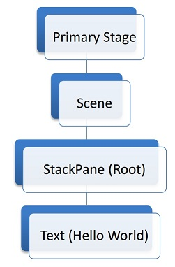
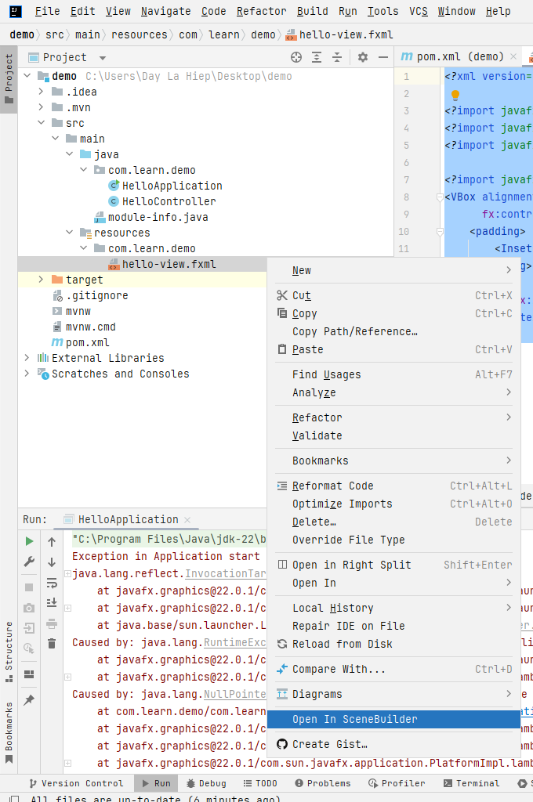
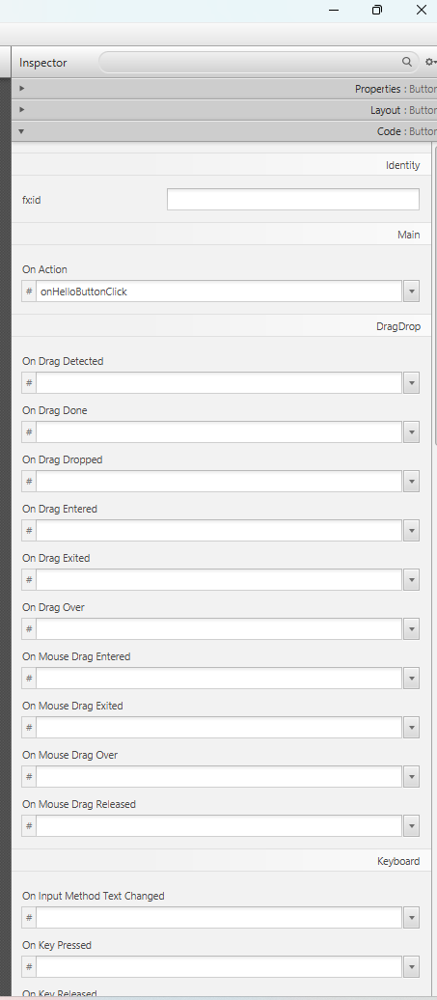
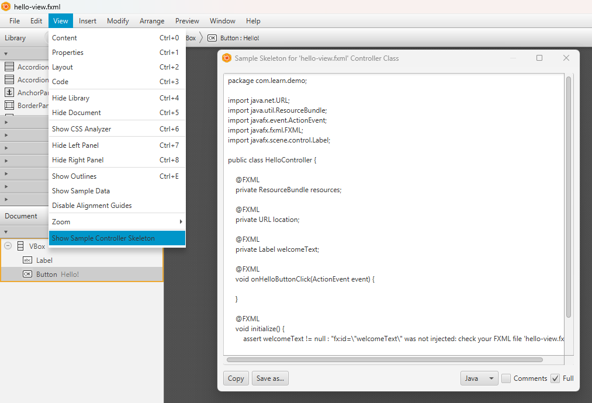

# Java fx.
## 1. Lập trình ứng dụng sử dụng javafx.
## 1.1 Tạo ứng dụng sử dụng javafx.
- Các bước:
   - Tạo một class chính kế thừa từ class `Application`.
   - Ghi đè phương thức `start` của class Application.
      - Tại đây sẽ chứa code chính của chương trình (khởi tạo giao diện, v.v)
   - Tại phương thức main, sử dụng lệnh launch().
- Ví dụ: Chương trình với chữ Hello World.
   ``` Java
   public class HelloApplication extends Application {
      @Override
      public void start(Stage stage) throws IOException {
         // Phần code chính
         StackPane pane = new StackPane(new Text("Hello World"));
         stage.setScene(new Scene(pane, 300, 300));
         stage.show();
      }
      public static void main(String[] args) {
         launch();
      }
   }
   ```
- Hai hướng lập trình giao diện.
   - Thuần code.
   - Sử dụng code kết hợp với file FXML.

## 1.2 Cấu trúc giao diện:
   
- Trên cùng là một `Stage`. Mỗi stage chỉ chứa duy nhất 1 `Scence`.
- `Scene` là nơi chứa các `node` (button, checkbox, text,...).
- Một số thuộc tính của node cha cũng được chia sẻ với node con.
## 2. Sử dụng SceneBuilder, FXML để lập trình giao diện trong javafx.
### 2.1 File fxml, class Controller.
- Class controller là một lớp được sử dụng để xử lý logic cho giao diện người dùng được định nghĩa trong file FXML.
- Mỗi file fxml đều phải liên kết đến một class Controller.
- Mô tả file FXML:
   - Gồm thẻ gốc (các container như VBox, HBox, v.v) để bố trí các thành phần giao diện.
   - Thẻ gốc này có thuộc tính fx:controller để liên kết file fxml với một class controller để xử lý logic.
   - Các thẻ thành phần UI (Label, Button, TextField, v.v) được định nghĩa, nằm trong thẻ gốc.
   - Có thể sử dụng SceneBuilder để sắp xếp các thành phần này dễ dàng hơn (kéo thả).
   - Ví dụ:
      ```  xml
         <?xml version="1.0" encoding="UTF-8"?>

         <?import javafx.geometry.Insets?>
         <?import javafx.scene.control.Label?>
         <?import javafx.scene.layout.VBox?>

         <?import javafx.scene.control.Button?>
         <VBox alignment="CENTER" spacing="20.0" xmlns:fx="http://javafx.com/fxml"
               fx:controller="com.learn.demo.HelloController">
            <padding>
               <Insets bottom="20.0" left="20.0" right="20.0" top="20.0"/>
            </padding>

            <Label fx:id="welcomeText"/>
            <Button text="Hello!" onAction="#onHelloButtonClick"/>
         </VBox>
      ```
      - Như ở ví dụ trên thì thuộc tính fx:controller thuộc thẻ VBox.
      - "fx:controller="com.learn.demo.HelloController" -> định nghĩa class Controller.
      - Bên trong thẻ VBox còn chứa các thẻ thành phần khác như Label, Button, v.v
### 2.2 FXMLLoader.
- FXMLLoader được sử dụng để tải và khởi tạo giao diện từ file FXML. (giả sử file FXML có thẻ gốc là một đối tượng Vbox, ta có thể lấy đối tượng Vbox này từ file fxml).
- Một số phương thức của FXMLLoader.
   - load(): tải đối tượng giao diện để sử dụng (giả sử file FXML có thẻ gốc là một đối tượng Vbox, ta có thể lấy đối tượng Vbox này từ file fxml).
   - getController(): lấy object Controller tương ứng với file FXML.
   - v.v
- Ví dụ:
   ``` Java
      public class HelloApplication extends Application {
         @Override
         public void start(Stage stage) throws IOException {
            FXMLLoader fxmlLoader = new FXMLLoader(HelloApplication.class.getResource("hello-view.fxml"));
            VBox pane = fxmlLoader.load();
            Scene scene = new Scene(pane, 320, 240);
            stage.setTitle("Hello!");
            stage.setScene(scene);
            stage.show();
         }

         public static void main(String[] args) {
            launch();
         }
      }
   ```
   - Như code trên, ta đã lấy được đối tượng Vbox từ file fxml và gán vào biến pane.
   - Sau đó, ta tiếp tục thực hiện lập trình giao diện như thường.
### 2.3 Xử lý sự kiện kết hợp với file FXML.
- Hướng dẫn sử dụng trên SceneBuilder.
   - Mở file FXML từ Intellij:
   
   - Định nghĩa method, tên cho node tại tab Inspector/Code.
   
   - Cùng lúc đó tại class Controller cũng định nghĩa tên hàm tương tự (hoặc ta có thể sử dụng SceneBuilder: chọn View/Show Sample Controller Skeleton sau đó copy phần định nghĩa hàm cần sử dụng để xử lý event)
      
      - Class HelloController.
         ``` Java
         public class HelloController {
            @FXML
            private Label welcomeText;

            @FXML
            protected void onHelloButtonClick() {
               welcomeText.setText("Welcome to JavaFX Application!");
            }
         }
         ```   
      - File FXML:
         ``` xml
         <?xml version="1.0" encoding="UTF-8"?>

         <?import javafx.geometry.Insets?>
         <?import javafx.scene.control.Label?>
         <?import javafx.scene.layout.VBox?>

         <?import javafx.scene.control.Button?>
         <VBox alignment="CENTER" spacing="20.0" xmlns:fx="http://javafx.com/fxml"
               fx:controller="com.learn.demo.HelloController">
            <padding>
               <Insets bottom="20.0" left="20.0" right="20.0" top="20.0"/>
            </padding>

            <Label fx:id="welcomeText"/>
            <Button text="Hello!" onAction="#onHelloButtonClick"/>
         </VBox>
         ```


## 3. Một số component cơ bản khi sử dụng SceneBuilder.
- Cơ bản:
   - Label.
   - Button.
   - TextField: nhập văn bản một dòng.
   - TextArea: nhập văn bản nhiều dòng.
   - CheckBox.
   - ...
- Container:
   - HBox: Bố trí các thành phần theo hàng ngang.
   - VBox: Bố trí các thành phần theo cột dọc.
   - BorderPane: Bố trí các thành phần theo vùng (trên, dưới, trái, phải, giữa).
   - GridPane: Bố trí các thành phần theo lưới.
   - AnchorPane: Bố trí các thành phần với vị trí cố định.